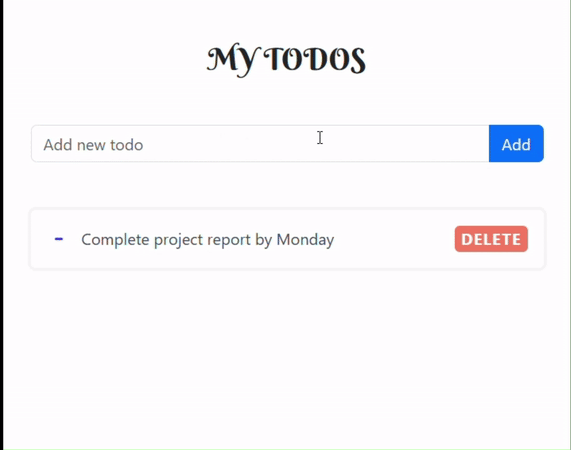

# Todo Application

## Demo

Here’s a small demo showing the working of the Todo Application:



A modern Todo application with a client-server architecture. The application is built with:

- **Frontend**: Angular 18 for the user interface.
- **Backend**: ASP.NET Core with Entity Framework Core for the API.

This project is structured as a mono repo, with separate submodules for the frontend and backend, allowing easy management and development.

---

## Features

- **API Integration**: Backend powered by ASP.NET Core, with a RESTful API for communication between frontend and backend.
- **Database**: Uses SQL Server with Entity Framework Core for data management.
- **Responsive UI**: Developed with Angular 18, designed to work across different screen sizes.

---

## Architecture

The project consists of two main components:

1. **Frontend (UI)**: Developed using Angular 18. The UI interacts with the backend through HTTP requests.
2. **Backend (API)**: Built with ASP.NET Core, which handles business logic and data processing, interacting with SQL Server via Entity Framework Core.

Both the UI and API are stored in separate submodules for modular development.

---

## Technology Stack

- **Frontend**:

  - Angular 18
  - TypeScript
  - HTML5
  - CSS3 (or SCSS)
  - RxJS

- **Backend**:

  - ASP.NET Core
  - Entity Framework Core
  - SQL Server (or any other relational database supported by EF Core)

- **Version Control**:
  - Git (with submodules for UI and API)

---

## Getting Started

### Prerequisites

Ensure you have the following installed on your machine:

- [Angular CLI](https://angular.io/cli) (v15 or higher)
- [.NET SDK](https://dotnet.microsoft.com/) (v7.0 or higher)
- [SQL Server](https://www.microsoft.com/en-us/sql-server) (or another supported database)

---

### Clone the Repository

1. Clone the repository with submodules included:
   ```bash
   git clone --recurse-submodules https://github.com/rahulmandal0207/p_todo_app.git
   cd p_todo_app
   ```
